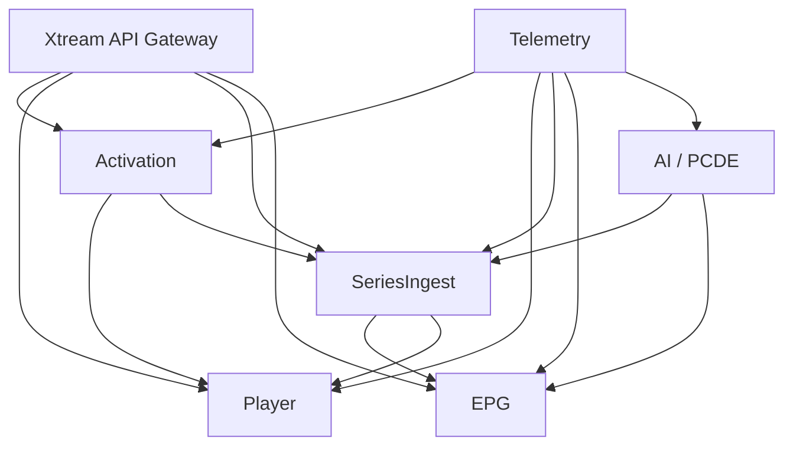

# MiraTV Feature Dependency Map

## Component Relationships

- **Activation System**
  - Depends on: Xtream API Gateway, Telemetry System
  - Provides: Credentials/session for Player System, Series Ingest Pipeline

- **Player System**
  - Depends on: Activation System, Xtream API Gateway, EPG System
  - Provides: Playback, channel navigation

- **EPG System**
  - Depends on: Series Ingest Pipeline, Xtream API Gateway
  - Provides: Guide data to Player System

- **Series Ingest Pipeline**
  - Depends on: Xtream API Gateway, AI / PCDE
  - Provides: Series metadata to EPG System, Player System

- **AI / PCDE**
  - Depends on: Telemetry System
  - Provides: Data enrichment, pipeline guidance to Series Ingest Pipeline, EPG System

- **Telemetry System**
  - Provides: Monitoring/logging for all systems

- **Xtream API Gateway**
  - Provides: Data endpoints for Activation, Player, Series Ingest, EPG

---

## Dependency Diagram

---

## Notes
- All major systems are monitored by Telemetry.
- Xtream API Gateway is the central data provider.
- Activation is required for Player and Series access.
- AI / PCDE enriches ingest and guide data.
